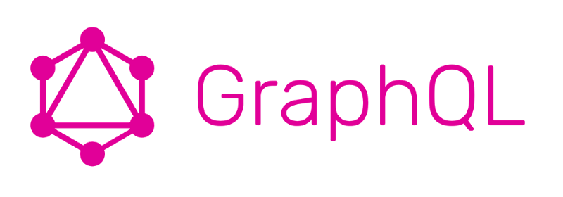
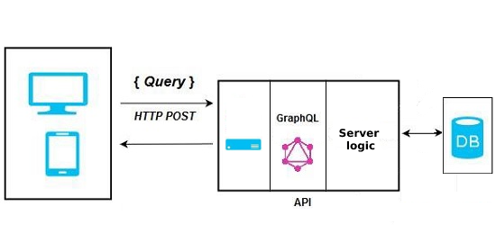

# Clase de GraphQL - Ejemplo de Tareas


[](https://travis-ci.com/uqbar-project/eg-tareas-graphql)
## Introducción

### ¿Qué es GraphQL?
Según la [documentación oficial](https://graphql.org) GraphQL es un lenguaje de consultas para APIs así como también una solución para satisfacer esas consultas con la información existente en el sistema.  

### Claro si, ¿Pero qué es GraphQL?
Cuando construimos un backend lo hacemos para ofrecer una interfaz que nos permita interactuar con el sistema de una manera especifica, segura y acotada, siguiendo el principal estándar que son las API REST.

Durante las clases hemos visto mejores practicas y estrategias de diseño para llegar a soluciones flexibles y escalables, sin embargo las API RESTs tienen un cierto factor de rigidez al cambio en la medida que las formas con las que podemos interactuar con un endpoint de una API REST se limitan a endpoints, query params, headers y un body. Lo que GraphQL propone es tener un lenguaje de consultas completo para desde el cliente poder realizar consultas más complejas sin necesidad de alterar la implementación.

Vale la pena mencionar que GraphQL no está atado a ninguna tecnología, simplemente es una capa intermedia entre el punto de entrada del backend y la propia implementación del mismo.



## Ejemplo

Para este ejemplo vamos a usar un front escrito en `React` y un backend hecho en `NodeJS` con una biblioteca muy utilizada para manejar peticiones HTTP que se llama `express` y `MongoDB` para la base.

### Como se levanta

### Backend

1. Instalamos las dependencias con `npm` con el comando:
```bash
npm i
```

2. Ponemos a correr la instancia de `mongo` en docker con el siguiente comando:
```bash
docker-compose up
```

3. En la carpeta raíz del back crear un archivo llamado .env con la url para conectarse a mongo, en mi caso es:
```
DB_URL=mongodb://localhost:27017/tareas
```

Por defecto la aplicación corre en el puerto 8080 pero podemos proveer un valor diferente para la variable `PORT` en este mismo archivo si así lo deseamos.

4. Ponemos a correr el server con:
```bash
npm run dev
```

En este punto el server está corriendo y podemos acceder a la interfaz grafica que provee opcionalmente GraphQL para interactuar con la API en la url `localhost:8080/graphql`.

### Frontend

1. Instalamos las dependencias con `yarn` con el comando: 
```bash
yarn install
```

2. Creamos un archivo `.env` en la carpeta raíz del front con el siguiente contenido:
```
REACT_APP_GRAPHQL_API_URL="http://localhost:8080/graphql"
```

3. Iniciamos el server de react con el comando:
```bash
yarn run dev
```

### Hablemos de endpoints
En el mundo de las API Rest estamos acostumbrados a lanzar distintos metodos HTTP contra varios endpoints del servidor. En GraphQL desaparece la idea de endpoint, se utilizará un único punto de entrada y solamente se interactuará por metodos POST.

### Schema
Para poder interactuar con la API lo que haremos será definir un `schema`. El schema en GraphQL es una representación del modelo de datos que es lo que le dotará de la capacidad de realizar consultas más complejas.
En el schema podemos definir:
- tipos de datos, que en general van a representar las entidades o clases del modelo.
- inputs, que van a definir los tipos de entrada para las distintas operaciones que queramos realizar.
- peticiones, que van a ser los "puntos de entrada" de GraphQL

### Peticiones
Para interactuar con GraphQL tenemos dos tipos de peticiones: `Queries`, que son peticiones de consulta, y `Mutations`, que son peticiones con un efecto colateral (updates, craetes y deletes por ejemplo).
Todas las peticiones hacia GraphQL se realizan mediante una request POST y en el body se detallara la query o mutation a realizar junto con los datos de entrada correspondientes.

### Resolvers
Toda la magia de GraphQL se reduce a los resolvers, en el schema nosotros definimos cuales van a ser las peticiones que se pueden realizar, al levantar el server tenemos que especificar cual es la función que se va a ejecutar para manejar cada peticion, a esa funcion se la denomina resolver.
